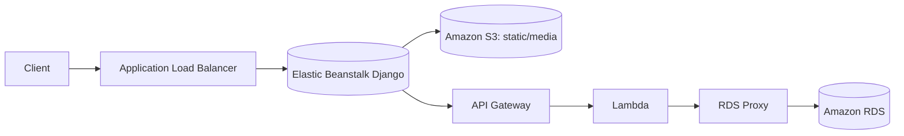
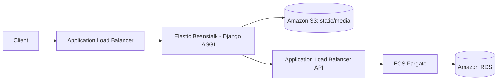

# Meta AWS Capstone Project

This repository showcases my work in deploying a Django-based capstone project to AWS.  
The original project was developed as part of the [Meta Professional Certificate](https://www.coursera.org/professional-certificates/meta-back-end-developer), and this repository focuses on the DevOps and cloud migration aspects.

## Live
- https://www.vahltech.com

## Overview

The project offers a fully cloud-based solution for small and medium-sized entrepreneurs in the food service sector, with an estimated monthly maintenance cost capped at USD 100.00. The system is designed to be generic enough for different types of restaurants. It is also flexible enough to meet the needs of the three main business actors: managers, employees, and end customers (as well as the admin who holds all the privileges).

The goal is to enable restaurants to implement, at low cost and with high availability, a complete online ordering flow — from the digital menu to delivery — by leveraging AWS managed services to reduce operational effort and increase scalability.

This repository focuses on:

1. Migrating the database to Amazon RDS;
2. Deploying the back end to AWS Lambda;
3. Deploying the front end to AWS Elastic Beanstalk;
4. Hosting static and media files in Amazon S3;
5. Setting up CI/CD (evaluating GitHub Actions vs AWS native tools);
6. Documenting the AWS infrastructure and operational setup.

## Architecture

- **Frontend:** Django app on AWS Elastic Beanstalk;
- **API:** AWS Lambda behind Amazon API Gateway HTTP API (v2);
- **Database:** Amazon RDS, accessed by Lambda via Amazon RDS Proxy;
- **Assets:** Amazon S3 for static/media.

## Versions

### Version 1 (Current)

- Frontend on Elastic Beanstalk (ASGI – Gunicorn + Uvicorn): the frontend serves Django templates and handles all API calls server-side (no ORM), maintaining SSR and session control in Django;
- Backend on AWS Lambda + HTTP API Gateway: chosen for cost efficiency, scalability, and native JWT authorizer support in HTTP API Gateway v2. This avoids the header manipulation issues found in REST API Gateway v1 (which required mapping templates and could strip Authorization/JWT headers), simplifying the authentication flow and reducing cost/latency. The backend is built with Django REST Framework and deployed with AWS CDK for flexibility and maintainability.
- Database connectivity via RDS Proxy: Lambda’s ephemeral execution model can cause “connection storms” to RDS. RDS Proxy was added to pool and reuse connections, reducing cold-start DB failures and improving scalability under variable load.
- Static/media on S3; 

Purpose: validate frontend integration and API functionality in the cloud with reliable database connectivity, keeping operational costs around USD 100/month while leaving room for future real-time features without major re-architecture.

### Version 2 (Planned)
- Backend migrated from Lambda to ECS Fargate

Purpose: Although the backend already runs ASGI on Lambda via Mangum, executions are still ephemeral and there is no native support for WebSockets or long‑lived connections. If the application evolves to require real‑time features or continuous workloads and the budget increases, the plan is to migrate to ECS Fargate to run a native ASGI server with persistent workers, improving latency predictability and networking control.

---

## Components

1. Backend  
   - Path: `/backend/`  
   - Documentation: [`backend/README.md`](./backend/README.md)

2. Frontend  
   - Path: `/frontend/`  
   - Documentation: [`frontend/README.md`](./frontend/README.md)

3. DevOps / IaC  
   - Path: `/littlelemon-backend-cdk/`  
   - Documentation: [`littlelemon-backend-cdk/README.md`](./littlelemon-backend-cdk/README.md)

## Repository Structure
- `backend/` – Django REST API
- `frontend/` – Django UI app
- `littlelemon-backend-cdk/` – Infrastructure
- `littlelemon-documentation/` – Architecture docs and diagrams
