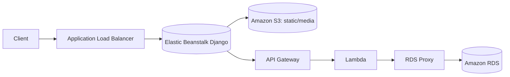
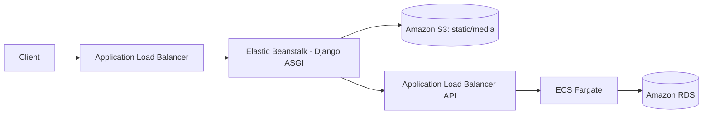

# Meta AWS Capstone Project

This repository showcases my work in deploying a Django-based capstone project to AWS.  
The [APIRest](https://github.com/Val-Cantarelli/MetaDeveloperProfessionalCertificate) was developed as part of the **Meta Professional Certificate**, and this repository focuses on the DevOps and cloud migration aspects.

## Overview

The project offers a fully cloud-based solution for small and medium-sized entrepreneurs in the food service sector, with an estimated operational cost of **~USD 85-90/month** in production for a Lambda-in-VPC architecture with RDS Proxy. The system is designed to be generic enough for different types of restaurants while being flexible enough to meet the needs of the three main business actors: managers, employees, and end customers (as well as the admin who holds all the privileges).

The goal is to enable restaurants to implement, at low cost and with high availability, a complete online ordering and reservation system — from the digital menu and table bookings to delivery — by leveraging AWS managed services to reduce operational effort and increase scalability.

This repository focuses on:

1. Migrating the database to Amazon RDS;
2. Deploying the back end to AWS Lambda;
3. Deploying the front end to AWS Elastic Beanstalk;
4. Hosting static and media files in Amazon S3;
5. Setting up CI/CD (evaluating GitHub Actions vs AWS native tools);
6. Documenting the AWS infrastructure and operational setup.

## Architecture

- **Frontend:** Django app on AWS Elastic Beanstalk (basic customer interface with limited functionality);
- **API:** AWS Lambda behind Amazon API Gateway HTTP API (v2) - fully featured REST API;
- **Database:** Amazon RDS, accessed by Lambda via Amazon RDS Proxy;
- **Assets:** Amazon S3 for static/media.

## Versions

### Version 1 (Current)

## Technical Details

- Frontend on Elastic Beanstalk (ASGI – Gunicorn + Uvicorn): provides basic customer interface with Django templates (menu browsing, user authentication, table booking). Ordering system, cart management, order tracking, and role-based access are API-only;
- Backend on Lambda (Mangum ASGI): complete REST API with JWT authentication, role-based permissions (manager/delivery-crew/customer), shopping cart, order management, menu administration, and comprehensive filtering/pagination;
- Stateless across environments: frontend makes HTTP calls to the API Gateway, enabling independent scaling and clear separation of concerns. 

Purpose: validate frontend integration and API functionality in the cloud with reliable database connectivity, keeping operational costs around **~USD 85-90/month** while leaving room for future real-time features without major re-architecture.

## Cost Breakdown

Based on realistic production usage (~1,000 API requests/day, ~10,000 frontend page views/month, 1GB DB storage):

| Service | Description | Est. Monthly Cost (USD) |
|---------|-------------|-------------------------|
| VPC Interface Endpoints | Secrets Manager, SSM, RDS Proxy (PrivateLink) | ~$45.00 |
| Amazon RDS (t3/t4g.micro) | Instance + 20 GB storage | ~$21.00 |
| RDS Proxy | Persistent connection pooling | ~$3.00 |
| Elastic Beanstalk (EC2) | Django frontend under light load | ~$10.00 |
| Application Load Balancer | HTTPS listener + LCU usage | ~$5.00 |
| API Gateway | ~30,000 HTTP requests | ~$1.50 |
| Lambda | ~30,000 invocations | ~$0.20 |
| Route 53 | Hosted zone + DNS | ~$0.50 |
| Secrets Manager | 1 secret | ~$0.40 |
| S3 | Static assets (~1 GB) | ~$0.10 |
| CloudWatch | Logs from Lambda and ALB | ~$0.50 |
| **Total Estimated** | **Light production use** | **~$85–90/month** |

*Note: Costs may vary based on actual usage patterns. If Lambda runs outside VPC or Aurora Serverless v2 is used, monthly costs can drop to $5-12 (planned for future architecture version).*

## Current Implementation Status

**Backend (REST API)**: Complete
- Full CRUD operations for menu items, categories, cart, orders
- JWT authentication with Djoser integration
- Role-based permissions (Admin, Manager, Delivery Crew, Customer)
- Comprehensive filtering, pagination, and search
- Rate limiting and security features
- OpenAPI 3.0 documentation

**Frontend (Customer Interface)**: ⚠️ **Limited Implementation**
- Menu browsing and visualization
- User authentication (login/signup)
- Table booking functionality (when logged in)
- Missing: ordering system, cart management, order tracking, user profiles, role-based interfaces
- All restaurant management and ordering features are API-only
- Suitable for demonstration but not production-ready for full restaurant operations

### Version 2 (Planned)
- Backend migrated from Lambda to ECS Fargate

Purpose: Although the backend already runs ASGI on Lambda via Mangum, executions are still ephemeral and there is no native support for WebSockets or long‑lived connections. If the application evolves to require real‑time features or continuous workloads and the budget increases, the plan is to migrate to ECS Fargate to run a native ASGI server with persistent workers, improving latency predictability and networking control.

---

## Components

1. Backend (REST API)  
   - Path: `/backend/`  
   - Documentation: [`backend/README.md`](./backend/README.md)
   - Status: **Complete** - Full-featured REST API with authentication, authorization, cart, orders, menu management

2. Frontend (Customer Interface)  
   - Path: `/frontend/`  
   - Documentation: [`frontend/README.md`](./frontend/README.md)
   - Status: **Limited** - Menu browsing, authentication, and table booking only. No ordering system implemented

3. DevOps / IaC  
   - Path: `/littlelemon-backend-cdk/`  
   - Documentation: [`littlelemon-backend-cdk/README.md`](./littlelemon-backend-cdk/README.md)

## Repository Structure
- `backend/` – Django REST API
- `frontend/` – Django UI app  
- `littlelemon-backend-cdk/` – Infrastructure as Code (AWS CDK)

## License

This project is open-source and available under the [MIT License](./LICENSE).
